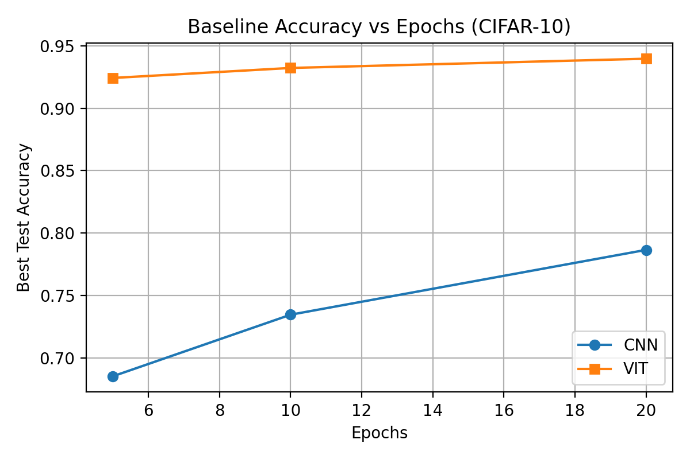

# CNN vs Vision Transformer: CIFAR-10 Clean & Corrupted 실험 

이 레포는 건국대 Microdegree 연구 과제를 정리한 것으로, CNN(ResNet-18)과 Vision Transformer(vit_tiny_patch16_224)를 대상으로 데이터 효율성과 강인성(Robustness)을 비교하기 위한 실험 파이프라인을 담고 있습니다. 세 노트북과 공통 모듈은 다음 연구 질문을 빠르게 반복 실험할 수 있도록 설계되었습니다.

- **RQ1.** 학습 데이터 양이 줄어들 때 두 모델의 정확도/손실은 어떻게 변하는가?
- **RQ2.** 깨끗한 이미지 대비 CIFAR-10-C corruption이 적용된 이미지에서 성능 저하 양상은 어떻게 다른가?
- **RQ3.** 간단한 학습 설정/증강 변화가 각 모델의 robustness에 미치는 영향은 무엇인가?

## 연구 목적과 필요성
- Vision Transformer는 대규모 데이터에서 강점을 보이지만, 학부 수준 프로젝트에서는 **데이터/연산 자원이 제한**되는 경우가 많습니다. 따라서 **데이터 효율성**을 정량 비교하는 것이 실용적인 의미를 가집니다.
- 실제 환경의 이미지는 노이즈·블러·조명 변화 등이 빈번하므로, **깨끗한 데이터에서의 성능만으로 모델을 선택하기 어렵습니다.** 따라서 CIFAR-10-C를 이용해 **robustness 관점**에서 CNN vs ViT를 비교합니다.
- Microdegree 커리큘럼에서 배운 일반화, 과적합, inductive bias 개념을 실제 코드/실험으로 검증해 보고자 했습니다.

## 연구 방법 요약
| 구성 | 내용 |
| --- | --- |
| 데이터 | CIFAR-10 (clean) + CIFAR-10-C (noise/blur/weather, severity 1~5) |
| 모델 | ResNet-18 (SGD) vs vit_tiny_patch16_224 (AdamW, timm) |
| 공통 모듈 | `cifar_common.py`에 DataLoader/모델/학습 루틴을 모듈화해 모든 노트북에서 재사용 |
| 노트북 01 | 깨끗한 CIFAR-10 baseline (epoch 5/10/20, CSV·가중치 저장) |
| 노트북 02 | `data_ratio` (1.0/0.5/0.2/0.1) 변화에 따른 데이터 효율성 비교 |
| 노트북 03 | baseline 가중치를 활용해 CIFAR-10-C 상에서 corruption×severity 평가 및 시각화 |

> **실행 가이드**
> 1. `Base` 디렉터리에서 conda/pip 환경을 활성화하고 `pip install -r requirements.txt` (필요 시) 진행.
> 2. `python` 셀을 통해 `cifar_common.py`에 정의된 `set_seed`, `create_cifar10_loaders`, `create_resnet18_cifar`, `create_vit_model`, `train_one_epoch`, `evaluate`를 import.
> 3. 세 노트북을 순서대로 실행하면 `results/` 폴더에 CSV/모델 가중치, `figures/` 폴더에 그래프가 생성됩니다.

## 주요 결과 (현재 저장된 결과 기준)
아래 표는 `results/baseline/*` CSV로부터 계산한 **최고 test accuracy**입니다.

| 모델 | Epoch | Best Test Acc |
| --- | --- | --- |
| CNN | 5 | 68.53% |
| CNN | 10 | 73.46% |
| CNN | 20 | 78.65% |
| ViT | 5 | 92.42% |
| ViT | 10 | 93.22% |
| ViT | 20 | 93.96% |

- ViT는 사전학습 weight를 활용함에도 불구하고 epoch 5부터 이미 CNN 대비 ~24%p 이상 높은 정확도를 보이며, epoch을 늘려도 **성능 향상이 점차 완만**해집니다.
- CNN은 데이터 효율성이 떨어지지만, epoch을 늘릴수록 꾸준히 개선되는 추세를 보여 **소규모 환경에서 baseline**으로 삼기에 적절합니다.

> **tip**: 추가로 노트북 02·03을 실행하면 `results/data_efficiency/`와 `results/robustness/`에 CSV가 쌓이며, README의 “주요 결과” 섹션을 확장해 RQ1/RQ2를 정량적으로 보고할 수 있습니다.

## 결론
- **결론**: 동일한 CIFAR-10 clean 조건에서는 ViT가 훨씬 높은 초기 성능을 제공하지만, CNN은 상대적으로 적은 자원으로도 baseline을 구축할 수 있습니다. 이후 데이터가 부족하거나 corruption이 심해지는 상황에서 두 모델의 간극이 어떻게 변하는지를 확인하는 것이 핵심입니다.
